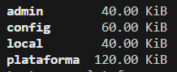
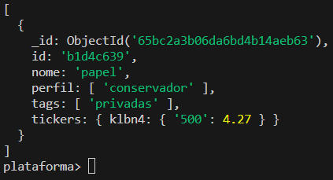

# Analise_de_carteira
Neste repositório, estou desenvolvendo um processo de análise de carteiras. A ideia é tratar arquivos json, contendo carteiras de investimento, usuarios e perfis de investimento. Esses arquivos são armazenados em banco NOSQL, e posteriormente tratados para que seja feita a análise da evolução dessas carteiras de investimento. 
Para acompanhar a evolução dos preços das ações, será feita extração diária, e o armazenamento será feito em banco de dados relacional. 
A plotagem dos dados será feita pelo uso da biblioteca Plotly.

# Tecnologias usadas:
* Mongodb
* Docker
* SQL
* Python

## Status do projeto:
* Docker Python: Feito
* Docker Mongo: Feito
* Docker Compose: Feito
* Python (criação dos documentos): Feito
* Pymongo (ETL arquivos json para o Mongo): Feito
* Docker MySQL: Feito
* Python (ETL cotações do dia para o MySQL): Feito
* Python (Análise dos arquivos)
* Plotly pendente

## Processo de carga no Mongodb:
O processo de carga dos documentos dentro das collections é feito conforme a seguir:

***Após clonar o repositório:***
docker-compose up (Este comando fará a construção das imagens Mongodb, Python e MySQL)

* 1 - docker run --name pythonapp  -it  <imagem_python:tag> bash
* 2 - python data_generator.py (***Este arquivo criará os documentos de exemplo***)
* 3 - python mongo_etl.py (***este comando inicia a carga dos arquivos json para o mongo***)

***Para checar os arquivos:***  
***Abra um terminal e insira o comando abaixo:***   
* 4 - docker exec -it <mongo_container> bash
* 5 - mongosh (***Esse comando inicia o mongo cli***)
* 6 - show dbs (***Mostra todos os databases, e você poderá ver o database plataforma***)
   

* 7 - use <banco de dados>   
* 8 - db.<collection>.find()   
   

## Processo de carga no MySQL:
No mesmo terminal aberto na etapa 1, insira o comando:
* python fundamentus_etl.py (***Esse comando fará a extração da tabela contendo os valores das ações do dia anterior e outros dados fundamentilistas ***)
### Checar carga no MySQL.
* docker exec -it <container_mysql> bash
* mysql -u root -p (após digitar esse comando será solicitada a senha:)
* senha = root (***Pode ser alterada no arquivo compose.yaml***)

## Análise: (***Em andamento***)
A análise consiste em verificar o avanço dos ganhos ou perdas de cada carteira armazenada no mongodb, bem como entender a concentração setorial e outros indicadores.

