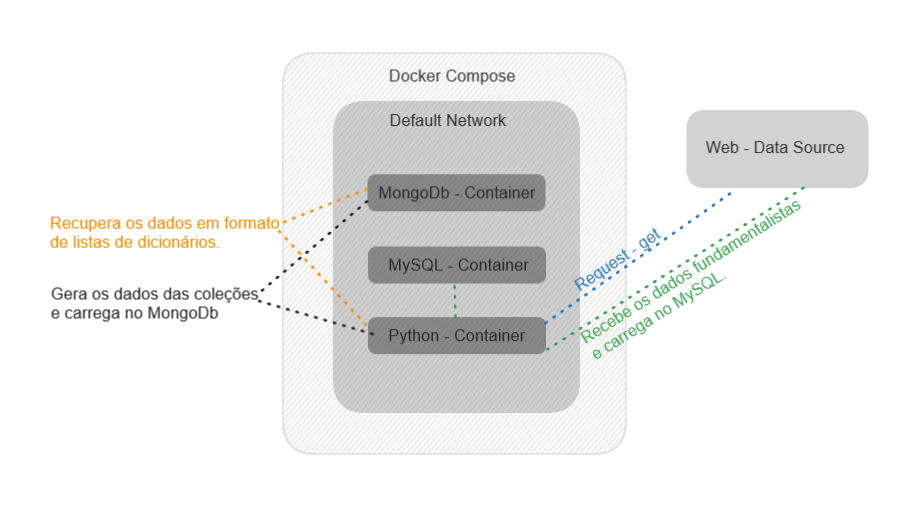
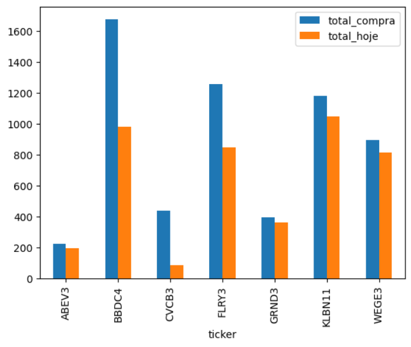
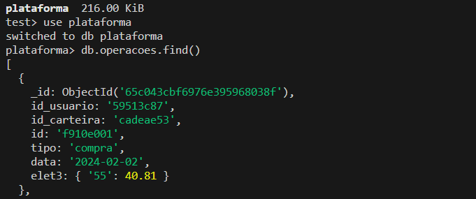

# Analise_de_carteira
Neste repositório, estou desenvolvendo um processo de análise de carteiras. A ideia é tratar arquivos json, contendo carteiras de investimento, usuarios e perfis de investimento. Esses arquivos são armazenados em banco NOSQL, e posteriormente tratados para que seja feita a análise da evolução dessas carteiras de investimento. 
Para acompanhar a evolução dos preços das ações, será feita extração diária, e o armazenamento será feito em banco de dados relacional. 

# Arquitetura
A arquitetura aqui usada visa apenas organizar o conhecimento do funcionamento dos conteineres com o docker-compose. Por esse motivo não há a utilização de recursos de Cloud.  

# Tecnologias usadas:
* Mongodb
* Docker
* MySQL
* Python

# Breve descrição do projeto: 
### Docker Python:  
Container que contém o script que cria os arquivos de usuários, carteiras e operações, bem como o ETL para os bancos MongoDB e MySQL. Dentro desse container existem os arquivos:
* 1 - environment.py: Módulo que contém todas as classes utilizadas nos módulos listados a seguir, esse módulo cria conexões, estrutura de pastas, logging, conexões e scripts de ETL.
* 2 - data_generator.py: cria os arquivos de usuários, carteiras e operações em formato .json.
* 3 - fundamentus_etl.py: Módulo que extrai os dados das ações d-1, carrega em um dataframe Pandas e escreve os dados no banco de dados MySQL.
* 4 - mongo_etl.py: Módulo que carrega no MongoDB, os arquivos .json gerados pelo módulo data_generator.
* 5 - analytics.py: Módulo que contém o script para criar o gráfico no matplotlib.
### Docker Mongo:  
Container criado para hospedar o banco de dados MongoDB. Este banco será utilizado para armazenar os dados que tem características que aderem a um modelo não relacional. Por exemplo, operações de compra e venda, que podem ter preços diferentes para a compra de uma mesma ação, ou usuários que podem ter mais de uma carteira. Para a criação desse container, é utilizada a imagem mongo:latest.
### Docker MySQL:  
Container utilizado para hospedar um banco de dados relacional MySQL. Neste banco de dados é armazenada a tabela com os dados das ações listadas na B3. Dados D-1 como Cotação, P/L, Crescimento nos últimos 5 anos e outros dados.
### Docker-Compose:  
Arquivo usado para declaração do conjunto de contêineres dentro de uma rede. A utilização desse arquivo yaml facilita a criação dos contêineres e configuração de disponibilidade de portas.

## Status do projeto:
| Etapa | Status |
| ------| ------ |
| Docker Python | Feito |
| Docker Mongo | Feito |
| Docker MySQL | Feito |
| Docker Compose | Feito |
| Python (criação dos documentos) | Feito |
| Pymongo (ETL arquivos json para o Mongo) | Feito |
| Python (ETL cotações do dia para o MySQL) | Feito |
| Exibição de gráfico preço compra x preço atual | feito |

## Processo de carga no Mongodb:
O processo de carga dos documentos dentro das collections é feito conforme a seguir:

***Após clonar o repositório:***
* 1 - docker-compose up (Este comando fará a construção das imagens Mongodb, Python e MySQL. Após alguns minutos acompanhando o log no terminal, será apresentada a mensagem "ready for connections" para o container mysql.)

docker exec 2bb8fa481def0bd90e8cc465d09f464ee236bd97e311381f36cfdbeb3d3f2ae4 python3 fundamentus_etl.py

* docker run -it analise_de_carteira-python-app:latest bash   (Este comando executará o container python, e deixará este container em execução.)
### Execução dos módulos.
* docker exec <id do container python> data_generator.py
* docker exec <id do container python> mongo_etl.py
* docker exec <id do container python> fundamentus_etl.py
### Checando o conteúdo dos bancos de dados após as execuções:
Abra mais um terminal e execute o comando:
docker exec -it 72b152891f3eedfa8b9b695e3d8fed20581e180d9e8a1f4990728e5a5fba716f bash
* docker exec -it <id do container MongoDB> bash
* mongosh
* use plataforma
* db.<nome da collection>.find() ***Exemplo: db.usuarios.find***
Essa sequência de comandos guia a consulta de uma collection no Mongodb.
Abra mais um terminal e execute o comando:
* docker exec -it <id do container MongoDB> bash
* mysql -u root -p ***neste projeto o user é root, mas vc pode alterar no arquivo compose.yaml***.
* insira o password ***"root" neste projeto, mas vc pode alterar no arquivo compose.yaml***.
* use db ***Selecionará o banco de dados db***
* select * from fundamentus;

## Análise:
A análise consiste em verificar o avanço dos ganhos ou perdas de cada carteira armazenada no mongodb, bem como entender a concentração setorial e outros indicadores.

A primeira análise feita foi de variação entre valor comprado e valor atualizado, mensurando qual foi a perda ou ganho de cada ticker.  

Para fazer essa análise, foram feitas duas consultas: 
No Mongodb, foi consultada a coleção operacoes, que contém as compras, suas quantidades e valores. O arquivo utilizado é o python\analytics.py.

Exemplo de documento:  

No Mysql foi feita a consulta  do valor da cotação d-1 de todos os tickers. 

Para checar o gráfico, é possível executar o arquivo python\analytics.py localmente.

Próximos passos:

Revisitarei em breve esse projeto, pois tenho em mente que ficará melhor dividindo os módulos python em mais de um Container, e considero interessante utilizar o Streamlit para criar interação com o usuário.

