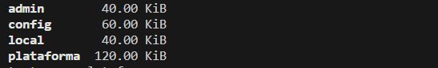

# Analise_de_carteira
Neste repositório, estou desenvolvendo um processo de análise de carteiras, utilizado Docker, Mongodb, SQL e Python. 

## Status do projeto:
* Docker Python: Feito
* Docker Mongo: Feito
* Docker Compose: Feito
* Python (criação dos documentos): Feito
* Pymongo (ETL para o Mongo): Feito
* Docker MySQL: Pendente
* Python (ETL para o MySQL): Pendente

## Processo de carga no Mongodb:
O processo de carga dos documentos dentro das collctions é feito conforme a seguir:

abra a pasta 
docker-compose up (Este comando fará a construção das imagens Mongodb, Python e MySQL)

docker run --name pythonapp  -it  test-python-app bash

Abra um terminal e insira o comando abaixo:  
docker exec -it <mongo container> bash

Abra outro terminal e insira o comando abaixo:
docker run -it --name pythonapp test-python-app

Em um outro terminal, digite os comandos abaixo:
mongosh
show dbs
   
use <banco de dados>   
db.<collection>.find()   
   

